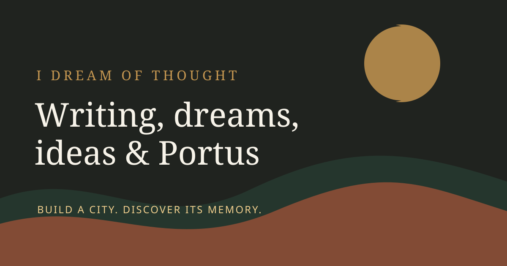

# Portus Game Server

**A mythic strategy game of favour, catastrophe, and deep-time lore.**

[](https://github.com/idreamofthought/portus-server/actions/workflows/ci.yml)
[](https://www.idreamofthought.org/)



Portus is a contemplative browser city-building game from Richard Jenkins and
the I Dream of Thought creative universe. This repository contains its Express
server, browser client, account and access systems, public site, and canonical
worldbuilding sources.

I Dream of Thought is a creative home for poetry, fiction, philosophy, dream
writing, nature, memory, and the ecology of imagination. Its interactive
flagship is **Portus**, a dreamlike city-building game about memory, myth, and
survival.

> Source is available here for viewing and development. No open-source
> licence is published; all rights are reserved on the code, writing, art,
> audio, and Portus lore unless a file states otherwise. See
> [License and reuse](#license-and-reuse) below.

## Portus

> **Build a city. Discover its memory.**

Portus is a surreal, atmospheric city-building game where a shipwreck survivor
shapes a fragile settlement beside the sea. Gather resources, build carefully,
interpret warnings, survive disasters, and uncover the lore of a world that
seems to remember what happens in it.

Portus is not designed as a race for expansion. It is a slower, stranger form
of strategy: a place to explore, endure, and learn what a landscape asks of the
people who inhabit it.

### Browser now, Steam next

Portus remains fully playable in a web browser. The browser release is the
primary launch build and the place where onboarding, progression, saves and
player retention will be tested first.

A desktop edition for Steam is the preferred future platform expansion. It
will reuse the same game rules, data, lore and save format rather than becoming
a separate fork. Steam packaging, ownership verification and store pricing
will live at the platform boundary; they will not be embedded in the gameplay
simulation. A smartphone edition is not currently planned because the map and
panel-heavy interface are better suited to a larger screen.

The current 24x24 pixel-art direction will be retained for the browser launch.
Before a Steam release, presentation work will focus on crisp desktop scaling,
readable panels, stronger terrain and building silhouettes, fullscreen and
resolution options, sound controls, accessibility, and polished store assets.
A wholesale graphical rebuild is not a prerequisite for validating the game.

### Explore the project

- [I Dream of Thought](https://www.idreamofthought.org/) - the writing and creative archive
- [Play Portus](https://www.idreamofthought.org/game) - enter the game
- [About Portus](https://www.idreamofthought.org/portus/) - read the premise and world overview
- [Writing archive](https://www.idreamofthought.org/writing/index.html) - poetry, fiction, philosophy, dreams, and ideas
- [Portus lore](lore/README.md) - worldbuilding, Codex, myths, events, and narrative sources
- [Portus documentation](docs/README.md) - systems, worldbuilding, artifacts, and developer guides
- [Steam-first platform plan](STEAM.md) - browser launch gates, shared-core boundaries, and the future desktop release

## What this repository contains

The repository contains the full Portus server and public creative site:

- Express routes for authentication, access, saves, payments, and webhooks
- The browser game client and protected game mode
- The I Dream of Thought homepage and writing tree
- Modular resource, research, favour, disaster, warning, and Codex systems
- Canonical Portus lore, quests, items, events, and NPC dialogue

For API contracts, see [API.md](API.md). For launch and deployment checks, see
[LAUNCH.md](LAUNCH.md) and [the Railway checklist](docs/RAILWAY-DEPLOYMENT-CHECKLIST.md).

## Features

### Dreamlike UI

- Translucent panels and blurred glass effects
- Soft glowing borders and atmospheric resource ledger
- Serif typography and floating glyph-style buttons
- Portus wordmark and inharmonic ambient soundscape

### Pixel-Art World (24x24 Tiles)

- 24x24 terrain tiles on a 50x33 map
- Grass, forest, mountain, river, sea, sand, and resource deposits
- Camera movement by dragging and zoom controls
- Building placement with terrain validation and distinct placement sounds
- Dynamic rendering and resource update loop

### Game Systems

The game client and server currently expose these systems:

- **Resources** - wood, stone, food, and gold
- **Research** - research progress and unlocks
- **Favour** - mystical influence and twilight state
- **Disasters** - random events that challenge the settlement
- **Warnings** - prophetic messages and resource alerts
- **Codex** - lore and world knowledge

### Authentication and Payments

- Email signup and verification
- Login, logout, password reset, and account controls
- CSRF protection and rate limiting
- Stripe and PayPal checkout
- PayPal capture webhook with signature verification and duplicate protection
- Time-based access system and protected `/game` route
- Platform-neutral permanent ownership for a future Steam edition

## Project Structure

`public/` is the live static client location mounted by Express. There is no root
`js/` client tree in the current repository.

```text
.
├── server.js, auth.js, middleware.js, email.js, resend.js
├── payments.js, products.js, database2.js, entitlements.js
├── public/                         served frontend and game client
│   ├── *.html                      auth, payment, legal, and entry pages
│   ├── *.js                        page-specific client modules
│   ├── shared.css                  shared auth and account styles
│   ├── images/                     optimized site images
│   └── sounds/                     canonical sound assets
├── protected/                      authenticated browser game
│   ├── game.html
│   ├── js/                         gameplay and presentation modules
│   └── css/                        game interface styles
├── homepage/                       public site and writing tree
│   └── portus/                     public Portus landing pages
├── portus/                         canonical worldbuilding sources
├── lore/                           worldbuilding index and migration target
├── migrations/                     explicit SQLite migrations
├── jest.config.js                  Jest integration-test configuration
├── test/                            unit, sandbox, and integration tests
│   └── integration/                 authenticated API and webhook coverage
├── API.md, MODULES.md, UI-GUIDE.md
├── MIGRATION-PLAN.md, WORLD-DESIGN.md
└── validate-structure.js           non-destructive layout checks
```

See [lore/README.md](lore/README.md) for the Portus content map and
[ROADMAP.md](ROADMAP.md) for planned work.

The authenticated API currently remains in `server.js`; `routes/` and `models/`
are planned boundaries, not current directories. Platform-neutral ownership is
implemented in `entitlements.js`, allowing a future Steam purchase to unlock
the same browser-compatible game without putting store logic into gameplay.

### Lore Structure

The lore index provides a stable home for the main worldbuilding strands:

```text
lore/
├── codex/
├── prologue/
├── world/
├── myths/
├── disasters/
└── fragments/
```

The current Portus source remains in `portus/` while these categories are
expanded and connected to the public site and in-game Codex.


## Running Locally

Install dependencies:

```bash
npm install
```

Copy `.env.example` to `.env` and supply real values. Never commit `.env`.

Start the server:

```bash
npm start
```

The server runs at `http://localhost:8080`. The public Portus page is available
at `http://localhost:8080/portus/`; authenticated play begins at
`http://localhost:8080/game`.

For local development, set `NODE_ENV=development` and use an HTTP `SITE_URL`, such as `http://localhost:8080`.

### Account Signup

Signup creates an unverified account and sends a verification email through
Resend. Production deployments must set `RESEND_API_KEY` and `EMAIL_FROM`,
using a sender address from a verified Resend domain. If delivery fails, the
new account is removed so the user can retry after email delivery is restored.

## Testing

Run the default Node test suite:

```bash
npm test
```

Run the authenticated API and webhook integration suite with Jest:

```bash
npm run test:integration
```

The launch sandbox test is opt-in because it exercises the deployed-style
launch flow:

```bash
npm run test:launch-sandbox
```

Run the non-destructive repository structure check:

```bash
npm run validate:structure
```

## Deployment

Portus is deployed on Railway. The server exposes:

```text
/                    homepage
/public              public assets
/portus              public Portus landing page
/game                authenticated browser game
/game-assets         authenticated game JavaScript and CSS
```

Railway checks the `/health` endpoint and runs one replica in the configured
`us-east4-eqdc4a` region. Deployment settings are stored in `railway.json`.

Before testing signup on Railway, confirm `RESEND_API_KEY` and `EMAIL_FROM`
are present in the service variables and that the `EMAIL_FROM` domain is
verified in Resend. See the [Railway deployment checklist](docs/RAILWAY-DEPLOYMENT-CHECKLIST.md)
for the complete release checks.

The public landing page and protected game are routed separately. Game assets
are served only after authentication, email verification and an access check.

## Platform strategy

The browser game will be soft-launched to a small tester group before Steam
packaging begins. Evidence from tutorial completion, first saves, session
length and return play will guide later gameplay and presentation investment.

Access is expressed as a platform-neutral `portus_full_game` entitlement. A
future Steam integration must verify ownership server-side before granting that
entitlement; the client must never be trusted to declare a purchase. Existing
web timed passes and free tester access continue to work alongside permanent
ownership.

See [STEAM.md](STEAM.md) for release gates, proposed repository boundaries and
the decisions deliberately deferred until the browser beta produces evidence.

## PayPal Webhook

Create a webhook in the PayPal Developer Dashboard for the same app credentials used by the server. Set the URL to:

```text
https://www.idreamofthought.org/api/webhooks/paypal
```

Subscribe to `PAYMENT.CAPTURE.COMPLETED`, then copy the webhook ID into `PAYPAL_WEBHOOK_ID` in the deployment environment. The endpoint verifies PayPal's transmission signature, credits only matching pending orders, and safely ignores duplicate delivery events. For local testing, expose the server through an HTTPS tunnel and use that tunnel URL instead of `localhost`.

## Gameplay Overview

### Start

Enter a drifting dream-realm and begin shaping a settlement tile by tile.

### Build

Each building has placement rules, resource costs, and effects on the world. Invalid placements are rejected with gentle feedback. Successful construction plays a building-specific sound.

### Grow

Resources update continuously and appear in the floating ledger: wood, stone, food, and gold.

### Discover

The Codex reveals lore, research unlocks new abilities, warnings whisper prophetic hints, disasters challenge the settlement, and Favour influences mystical outcomes.

## Dreamlike UI Philosophy

The UI is soft, surreal, floating, translucent, quiet, and contemplative. It draws on mist, moonlight, blurred glass, drifting memories, and lucid dreams while the canvas remains pixel art.

## Before Production

1. Configure `JWT_SECRET`, Resend, Stripe, and PayPal credentials.
2. Register both payment webhooks.
3. Confirm final pricing, currency, and legal wording.
4. Replace draft legal and contact text.
5. Test signup, verification, login, purchase, game access, save/load, and expiry.
6. Confirm the PayPal webhook remains subscribed to `PAYMENT.CAPTURE.COMPLETED` and that `PAYPAL_WEBHOOK_ID` matches the current dashboard webhook.

## Daydream Housekeeping Robot

This repository includes **Daydream**, a small GitHub-native housekeeping robot
built from configuration and workflows in `.github/`:

- `housekeeping.yml` syncs housekeeping labels, runs stale issue and pull-request
  handling each day, and runs a weekly repository structure audit with the
  existing `npm run validate:structure` script.
- `issue-triage.yml` keeps a `needs-triage` label on issues that do not yet have
  one of the main classification labels.
- `ISSUE_TEMPLATE/*.yml` auto-apply the default GitHub labels for bug reports,
  feature requests, and questions.
- `stale.yml` and `housekeeping.json` hold the main knobs for adjusting timing,
  synced labels, and triage behavior.

The defaults are intentionally conservative: blank issues remain allowed, stale
conversations get a warning before closing, draft pull requests are exempt, and
milestoned work is never auto-closed.

## Structure Validation

Run the non-destructive consistency check with:

```bash
npm run validate:structure
```

It checks required directories and reports any legacy paths that need review.

## Security

Please do not report security vulnerabilities in public issues. See
[SECURITY.md](SECURITY.md) for the responsible disclosure process.

## License and reuse

This repository does not currently publish an open-source license. Unless a
file says otherwise, code, writing, artwork, audio, and Portus worldbuilding
remain copyright of their respective creators. Contact the project owner before
reusing or redistributing any material.
